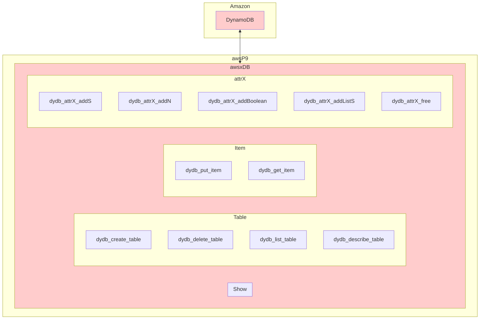
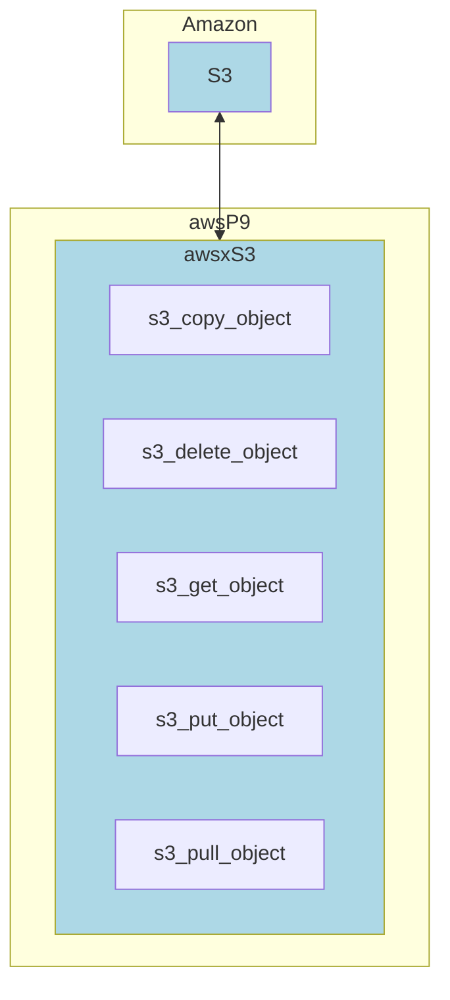

# 1. Overview

awsP9 is an api of [AWS SDK (Boto3)](https://boto3.amazonaws.com/v1/documentation/api/latest/index.html). We can save our time from learning AWS SDK.

Please also read [helper_AWS-CLI.md](https://github.com/lankahsu520/HelperX/blob/master/helper_AWS-CLI.md) and [helper_AWS-SDK.md](https://github.com/lankahsu520/HelperX/blob/master/helper_AWS-SDK.md).

# 2. Depend on

- [pythonX9](https://github.com/lankahsu520/pythonX9)

# 3. Current Status

#### A. DynamoDB



#### B. S3




# 4. Build
```bash
Do nothing
```
# 5. Example or Usage

#### - awsP9-db_123.py - an example of how to access DynamoDB.

```bash
$ make awsP9-db_123.py
or
$ ./awsP9-db_123.py -d 3
```

#### - awsP9-s3_123.py - an example of how to access S3.

```bash
$ make awsP9-s3_123.py
or
$ ./awsP9-s3_123.py -d 3
```

# 6. License

pythonX9 is under the New BSD License (BSD-3-Clause).


# 7. Documentation
Run an example and read it.
